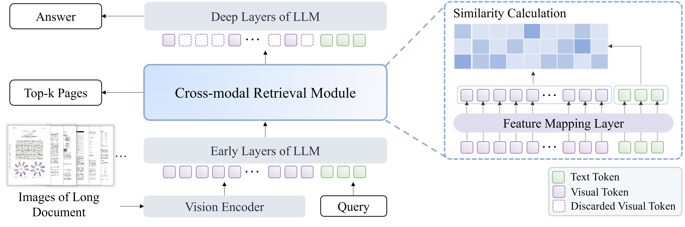
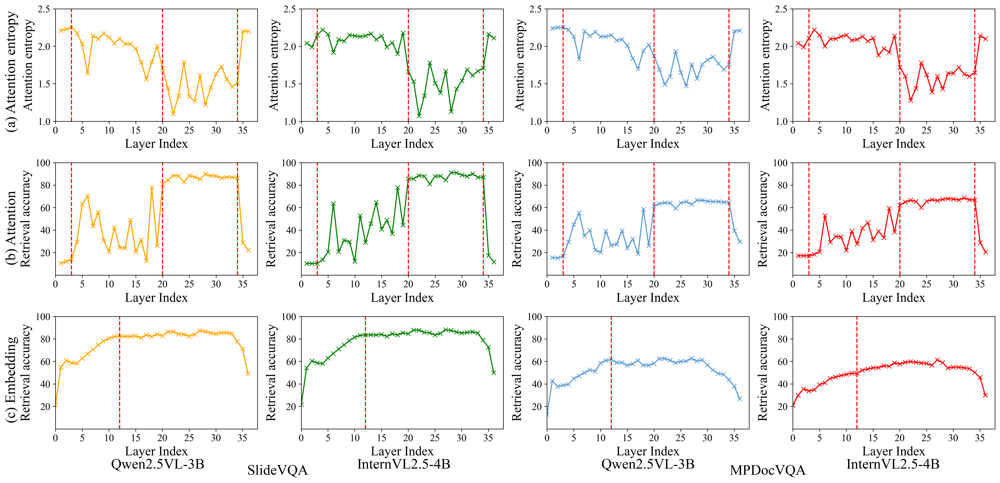
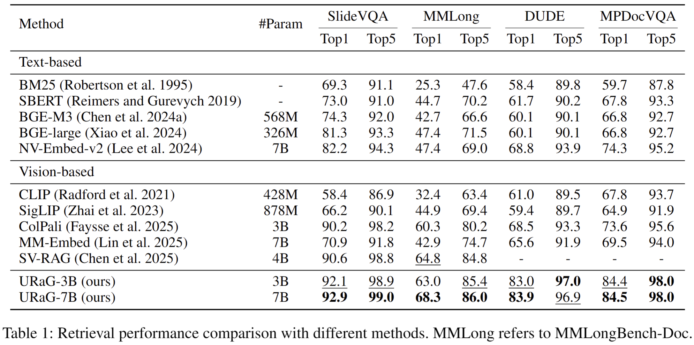
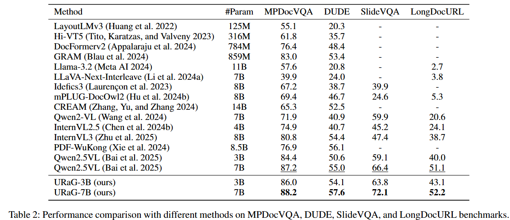
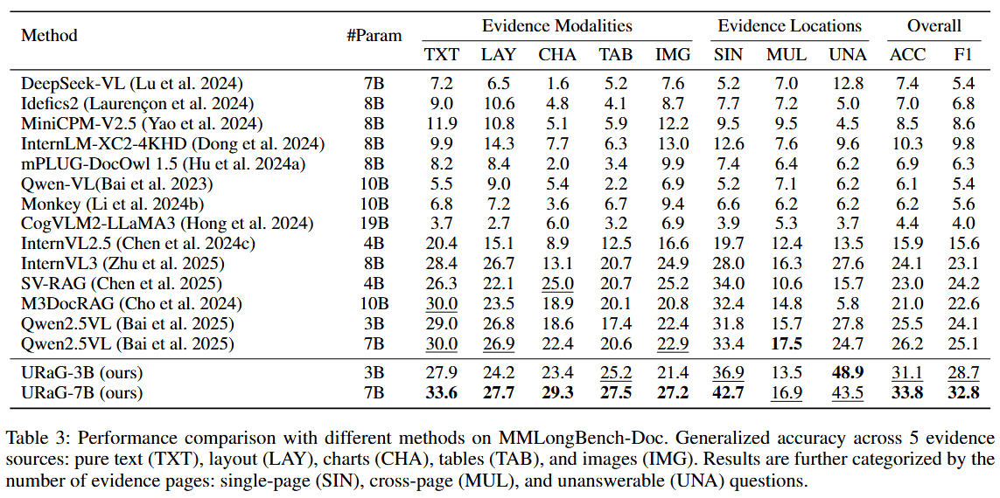

<h1 align="center">
  URaG (AAAI 2026 Oral)
  <div align="center" style="font-size: 0.55em">
    Unified Retrieval and Generation in Multimodal LLMs for Efficient Long Document Understanding
  </div>
</h1>

<div align="center">
  <a href="https://arxiv.org/abs/2511.10552">
    
  </a>
</div>

<div align="center">
  <b> 🕖 The code will be released soon 🚧 </b>
</div>


The official implementation of *URaG: Unified Retrieval and Generation in Multimodal LLMs for Efficient Long
Document Understanding* (AAAI 2026 Oral). 

<div align="center">
  
</div>
<br>

**URaG** (**U**nified **R**etrieval **a**nd **G**eneration) is a simple-yet-effective unified framework that unifies retrieval and generation in a model for efficient long document understanding. Equipped with a lightweight cross-modal retrieval module, URaG explicitly leverages the inherent evidence localization capabilities of MLLMs to perform efficient and integrated retrieval.

## Introduction

While recent advances in multimodal large language models (MLLMs) have shown impressive performance on single-page documents, their effectiveness degrades significantly on long documents due to two fundamental challenges:

1. Information interference caused by a large amount of irrelevant content.
2. The quadratic computational cost of Transformer-based architectures, which makes long document processing computationally prohibitive.

To address these issues, we first conduct an empirical study and observe that MLLMs exhibit a human-like coarse-to-fine reasoning pattern: **early Transformer layers attend broadly across the document, while deeper layers focus attention on pages containing relevant evidence**. 

<div align="center">
  
</div>
<br>

Based on this insight, we posit that the inherent evidence localization capabilities of MLLMs can be explicitly leveraged to perform retrieval during the reasoning process, facilitating efficient long document understanding.

## Performance


<div align="center">
  
</div>
<br>

<div align="center">
  
</div>
<br>

<div align="center">
  
</div>
<br>

## Citation
```
@inproceedings{shi2026urag,
  title={URaG: Unified Retrieval and Generation in Multimodal LLMs for Efficient Long Document Understanding},
  author={Shi, Yongxin and Wang, Jiapeng and Shan, Zeyu and Peng, Dezhi and Lin, Zening and Jin, Lianwen},
  booktitle={Proceedings of the AAAI Conference on Artificial Intelligence},
  year={2026}
}
```

## Copyright
This repository can only be used for non-commercial research purpose.

For commercial use, please contact Prof. Lianwen Jin (eelwjin@scut.edu.cn).

Copyright 2026, [Deep Learning and Vision Computing Lab](http://www.dlvc-lab.net), South China University of Technology. 
